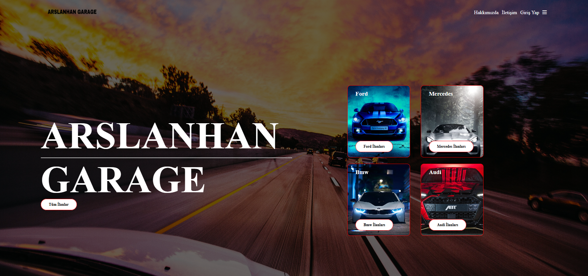
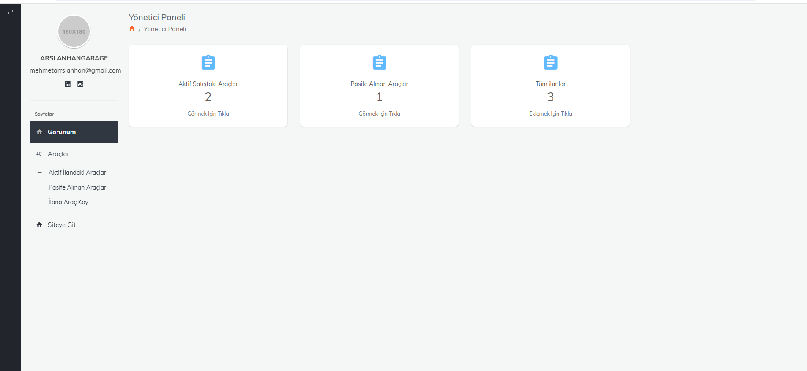
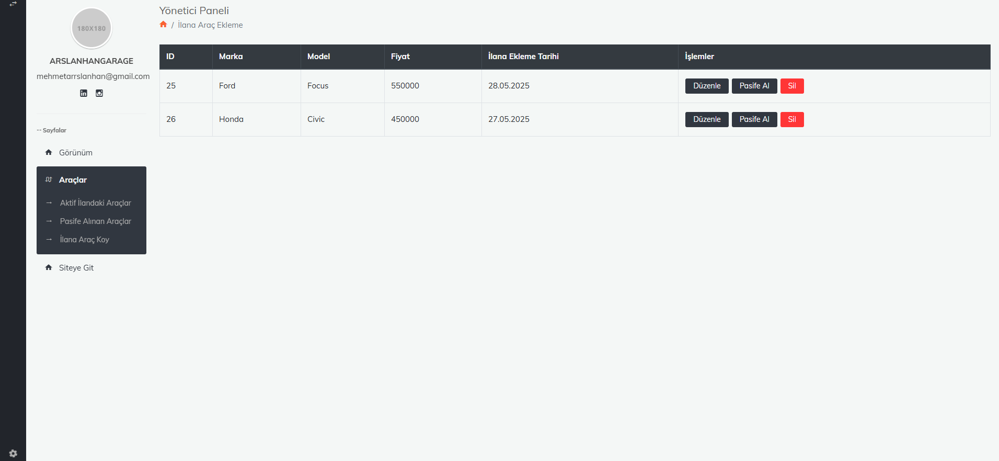

# 🚗 Araç Satış Web Sitesi

Bu proje, kullanıcıların araç ilanları ekleyip yönetebileceği, admin paneli ile ilanları kontrol edebileceği bir **Araç Satış Web Uygulamasıdır**. Web sitesi PHP ve MySQL ile geliştirilmiş olup frontend kısmında HTML, CSS (Bootstrap 4) ve JavaScript kullanılmıştır.

## 🛠 Kullanılan Teknolojiler

- **Frontend**: HTML5, CSS3, Bootstrap 4, JavaScript  
- **Backend**: PHP 
- **Veritabanı**: MySQL  
- **Diğer**:  JSON  

## 📌 Özellikler

- ✅ Kullanıcılar araç ilanı ekleyebilir  
- ✅ Marka-model seçimi dinamik 
- ✅ Görsel yükleme  
- ✅ İlanları listeleme, düzenleme, silme  
- ✅ İlan aktif/pasif durumu yönetimi  
- ✅ Admin paneli üzerinden kontrol  
- ✅ Güvenli form doğrulama ve veritabanı işlemleri  

## 🖼 Ekran Görüntüleri

### 📊 Genel Görünüm  

### 🚘 Admin Panel Genel Görünüm  

### ✏️ Aktif Araç İlanları  

